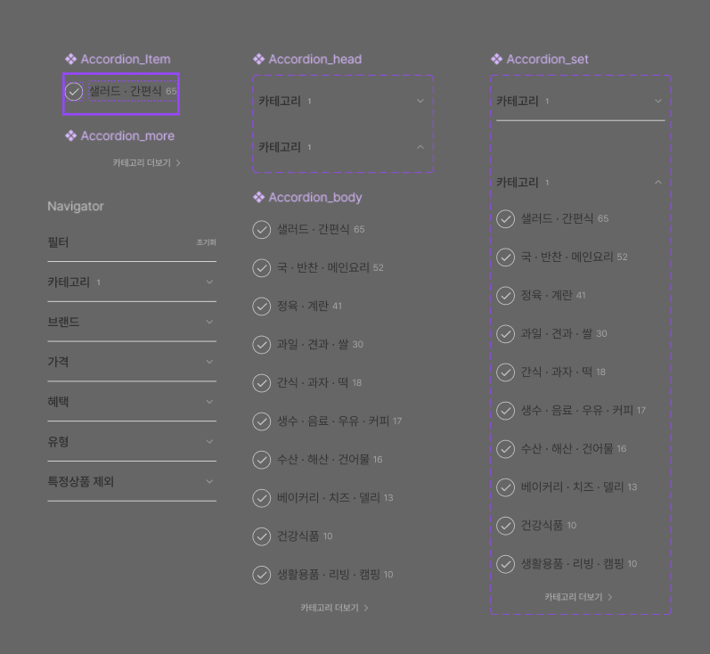
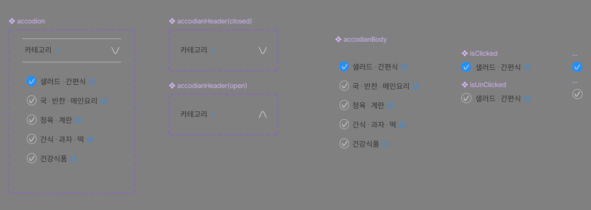

# 7월 26일 아토믹 컴포넌트 과제 설명

## 주제 설정과 제작한 Figma 설명

저희조는 저번 바닐라 프로젝트에서 마켓 칼리를 수행하였습니다.  
그 중 저는 이번 아토믹 컴포넌트 과제에서 수행하려고 하는 요소는 아코디언 메뉴를 선택하였습니다.  
다음 사진은 기존의 마켓 칼리의 아코디언 메뉴의 피그마 시안입니다.

  

그리고 그것을 바탕으로 제작한 피그마 시안입니다.

  

- 우선 아코디언 메뉴 안에 들어가는 요소인 체크박스와 라벨과 숫자를 상품의 개수를 알려주는 요소를 하나의 컴포넌트로 보았고 또한 체크박스가 체크되었을때와 체크되지 않았을때를 하나의 컴포넌트로 보았습니다.
  - 그 다음으로는 각각 체크되었을때와 체크 되지 않았을 때의 버튼을 직접 만들었습니다.(동그라미 안에 체크 모양은 벡터를 저절로 만들어주는 도구가 있을것 같은데 뭔지 모르겠어서 직접 펜으로 그려서 제작했습니다)
- 그 다음으로는 위에서 만든 체크박스 요소들이 합쳐져 있는 아코디언 바디를 하나의 컴포넌트 요소로 만들었습니다.
- 그 다음으로는 헤더를 하나의 컴포넌트 요소로 만들고 역시 펼쳐져 있을 때와 없을 때의 상태를 각각의 컴포넌트 요소로 보았습니다.(옆에 화살표도 직접 만들었습니다)
- 마지막으로 헤더와 바디가 합쳐진 하나의 아코디언을 하나의 컴포넌트 요소로 만들었습니다. 

## Figma를 기반으로 하는 컴포넌트 요소 설명(디자인 개발 핸드오프)

디자인을 개발로 핸드오프 하기 위해 저는 수업에서 배운 타입스크립트를 활용해서 진행하였습니다. 타입스크립트를 사용한 이유는 원래는 바벨을 사용해서 하려고 하였으나 수업시간때와 마찬가지로 컴포넌트 요소로 쪼개서 진행하려고 하였는데 쪼개니까 jsx가 동작하지 않아서 그냥 타입스크립트를 활용하여 진행하였습니다.  

### AccodionItem.tsx

- **컴포넌트 기능**
  - 상품의 요소를 체크하고 체크를 풀 수 있는 역할
  - 우선 프롭스를 객체 분해 할당을 사용하여 각각의 카테고리의 이름과 그에 해당하는 상품 개수를 받아서 사용
  - input의 type을 check박스로 설정하고 label에서 카테고리별 이름을 받음
  - 상품 개수는 span 태그를 사용하였고 span 태그 안에 받은 상품 개수를 넣음
- **스타일링**
  - input과 라벨을 묶어준 div에 position: relative, input에 position: absolute를 줌
  - 라벨 요소에는 배경이미지로 아까 피그마에서 만들었던 체크되지 않았을때의 버튼을 svg로 추출하여 넣어줌
  - 이때 이미지가 여러개 나오기 때문에 no-repeat을 사용해서 하나만 나오도록 함
  - input이 체크 되었을 경우에는 체크 상태의 버튼으로 배경이미지를 변경해주고 라벨의 색도 변경시켜줌

### AccodionBody.tsx

- **컴포넌트 기능**
  - 아코디언 아이템들을 묶어놓은 아코디언 몸체를 담당함
  - 우선 아이템에 들어가는 모든 요소들을 프롭스로 받고 해당 프롭스를 객체 분해 할당 사용해서 분해함
  - 가장 큰 요소로 ul을 넣고 그 안에 li 태그를 넣는 식으로 구성
    - 그러기 위해서 아까 위에서 받은 데이터들을 map 함수를 사용해서 li 요소 안에 위에서 만든 accodionItem 컴포넌트에 각각의 프롭스인 name과 count를 넣어줌
  - 위 방식을 통해 아코디언 바디 컴포넌트 제작
- **스타일링**
  - ul요소와 li 요소 각각의 display: flex를 줌
  - ul요소에는 figma에서 설정한대로 각각 패딩을 부여
  - li요소에는 text-decoration: none를 사용해서 li 사용시 있는 마커를 없앰

### AccodionHeader.tsx

- **컴포넌트 기능**
  - 아코디언에 가장 큰 카테고리를 보여주는 역할
  - 가장 큰 요소로 nav를 사용해서 묶어주고 그 안에 제목과 숫자를 묶은 div와 화살표 이미지를 img 태그를 사용해서 넣어줌
  - accodionItem과 마찬가지로 각각의 카테고리 이름과 그에 해당하는 상품 개수를 받아야 하기 때문에 각각을 프롭스로 받고 객체 구조 할당을 사용해서 받음
    - 받은 값들을 각각 p태그와 span태그 안에 넣어줌
  - 화살표를 이미지 태그를 이용해 아까 만든 화살표를 svg로 추출하여 넣어줌
- **스타일링**
  - span과 p태그를 묶은 div에 flex를 줘서 정렬이 되도록 함
  - 전체 nav에 역시 flex를 주고 justify-content: space-between을 줘서 div와 이미지 태그가 서로 떨어지도록 설정
  - 전체 nav에 피그마에서 설정한 패딩값대로 패딩 부여

### Accodion.tsx

- **컴포넌트 기능**
  - 위에서 만든 아코디언 바디와 헤더를 합쳐주는 역할을 하며 헤더 클릭 시 바디를 보이고 안보이게 하는 역할을 수행
  - 아코디언 완전체를 만드는 것이기 때문에 헤더와 바디를 받아오고 각각에 컴포넌트에 필요한 요소인 카테고리, number 그리고 아코디언 아이템에 들어갈 요소들을 프롭스를 통해 받아오고 그 요소들을 객체 분해 할당을 통해 받아 옴
  - 저번 프로젝트때는 js를 사용해서 수행했었는데 이번에는 html요소 중 detail을 사용해서 만들어보고자 해서 detail 사용
  - summary 부분에 위에서 만든 아코디언 헤더 부분을 넣어주고 위에서 받아온 데이터를 각각 전달하도록 함
  - article을 사용해서 아코디언 몸체를 구성하고 그 안에 위에서 만든 아코디언 바디 부분을 넣음
  - 그 다음으로는 리스트를 프롭스로 전달시켜 줌
- **스타일링**
  - detail이 open일 경우 화살표가 위쪽을 향하도록 애니메이션 부여
  - summary 부분에 flex를 주고 나오는 화살표를 지우기 위해 marker에 공백을 넣어줌

### AccodionPage.tsx

- **컴포넌트 기능**
  - 만든 아코디언 컴포넌트를 여러개 넣어서 보여주는 페이지
  - 아코디언 컴포넌트를 여러개 생성하고 그에 필요한 프롭스 값들을 넣어줌

### 그 외 요소들

- public/icons: input요소와 화살표 등의 아코디언 컴포넌트에 필요한 svg를 저장한 폴더
- data/datas.js: accodionItem에 필요한 값들을 저장한 객체
