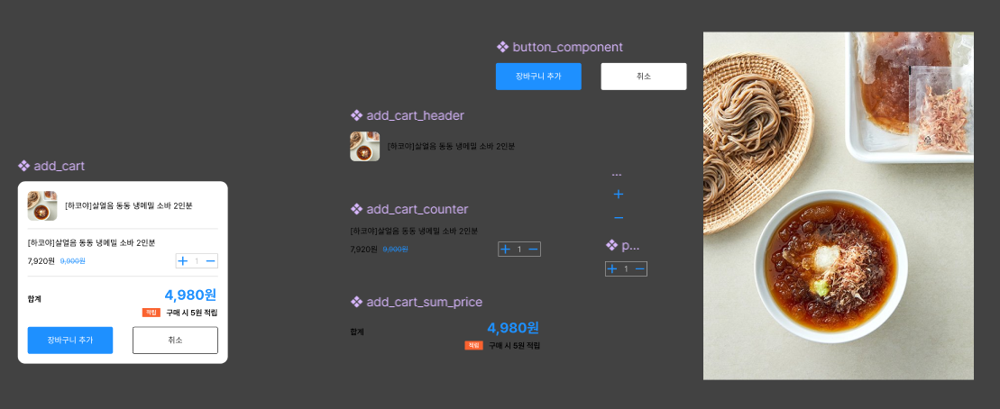

# 8월 2일 컴포넌트 속성 검사 및 테스트 과제 설명

## Figma 설명

저번 과제에서 했던거와 다르게 이번에는 다른 것으로 과제를 수행해봤다 아래 사진은 이번에 제작한 피그마이고 그 아래는 피그마 링크이다

 <br>
[🔗피그마 주소](https://www.figma.com/design/ugkmcjLuPDD9sIrGTeioKr/add-cart-figma?node-id=0-1&t=8BpSrxVGwISsKSSR-1)
<br><br>

## 컴포넌트 요소 설명과 컴포넌트 요소에 일치하는 prop 검사 수행 설명

### PlusMinusButton.jsx

- **컴포넌트 기능**
  - 상품 추가를 할 수 있는 + 버튼, 상품 추가 한 것을 뺄 수 있는 - 버튼 그리고 선택한 상품 개수를 볼 수 있도록 하는 기능 추가
  - 버튼 안에 svg를 넣어 + / - 모양을 만듦
  - 숫자는 p태그를 통해 볼 수 있도록 함
- **스타일링**
  - 버튼은 각각 높이와 너비를 지정해주고 배경색은 흰색으로 변경
  - p태그는 피그마에서 설정한대로 폰트를 설정하고 글자 크기만 rem으로 변경
- **프롭 검사**

  - 위 컴포넌트에서 받는 프롭스는 크게 count와 + 버튼을 누를 때 count 숫자를 증가할 수 있도록 하는 `addProducts` 함수와 - 버튼을 누를 때 count 숫자를 감소할 수 있도록 하는 `minusProducts` 함수로 구성됨
  - 그렇기 때문에 우선 count는 숫자이므로 `number.isRequired`를 사용해 숫자인 경우에만 성립하도록 변경
  - addProducts, minusProducts는 각각 함수이므로 `func.isRequired`를 사용해 함수인 경우에만 통과시키고 아닌 경우는 경고하도록 함
    - 그 결과 검사 코드는 다음과 같음
    ```js
    PlusMinusButton.propTypes = {
      count: number.isRequired,
      addProducts: func.isRequired,
      minusProducts: func.isRequired,
    };
    ```

### AddCartHeader.jsx

- **컴포넌트 기능**
  - 상품의 사진을 볼 수 있도록 하고 그 옆에 상품의 이름을 같이 보이도록 함
  - img와 p태그를 사용해서 구성함
- **스타일링**
  - flex를 통해 각각의 요소들을 정렬하고 그 사이 gap을 줌
  - align-item을 center로 줘서 서로 가운데 위치하도록 함
  - 사진의 크기를 지정해주고 글꼴도 피그마에서 주어진 형태대로 부여하고 마찬가지로 글자 크기만 rem으로 변경
- **프롭 검사**
  - 위 컴포넌트에서 받는 프롭스는 `title`과 `image` 경로 이렇게 2개를 받음
  - 우선 `datas.js`에 각각의 정보를 받고 난 후 객체로 저장
  - `globals.d.js`에 products의 타입을 검사하는 것을 전역으로 만들고 그 안을 `exact`를 사용한 후 title과 image를 각각 `string`으로 설정하여 검사하도록 함
  - 그 결과 검사 코드는 다음과 같음
  ```js
  AddCartHeader.propTypes = {
    products: productsType.isRequired,
  };
  ```

### AddCartCounter.jsx

- **컴포넌트 기능**
  - 상품의 개수를 설정할 수 있고 할인가와 원가를 볼 수 있도록 하는 컴포넌트
  - 위에서 만든 PlusMinusButton와 할인가와 원가를 볼 수 있도록 하는 각각의 p요소 그리고 상품의 이름을 볼 수 있는 span 요소로 이루어짐
  - 상품에 discount가 있으면 원가와 할인가를 없으면 원가만 보이도록 삼항연산자로 구현
- **스타일링**
  - 가장 큰 요소를 flex를 주고 방향을 column 방향으로 주고 gap을 부여
  - 가격과 +/- 버튼 컴포넌트를 하나로 묶고 flex를 부여한 후 justify-content를 space-between으로 부여
  - 할인가가 있을 경우 할인가는 검정색으로 원가는 dodgerblue 색과 가운데 줄 긋기를 통해 정가임을 들어냄
- **프롭 검사**
  - 여기서의 프롭스는 우선 상품 정보인 `products`와 `count`, `addProducts` 그리고 `minusProducts`가 있다
  - 실질적으로 쓰는 것은 `products` 밖에 없지만 하위에 있는 PlusMinusButton에 저 3개를 전달해야 하기 때문에 받음
  - 우선 실질적으로 사용하는 `discount`, `price`는 `globals.d.js`에 추가한 후 각각 `number`로 설정하고 title은 위에서 `string`으로 사용했기 때문에 그대로 사용
  - 위에서 설정한대로 count는 숫자이므로 `number.isRequired`로 addProducts, minusProducts는 각각 함수이므로 `func.isRequired`를 사용해 검사하도록 함
  - 그 결과 검사 코드는 다음과 같음
  ```js
  AddCartCounter.propTypes = {
    products: productsType.isRequired,
    count: number.isRequired,
    addProducts: func.isRequired,
    minusProducts: func.isRequired,
  };
  ```

### AddCartSum.jsx

- **컴포넌트 기능**
  - AddCartCounter에서 추가한 개수대로 가격이 변동하도록 하는 컴포넌트
  - 개수가 변하면 변한대로 가격이 변하도록 설정
- **스타일링**
  - 가장 큰 요소들은 flex 후 column 방향으로 설정
  - 각각의 작은 요소들은 또한 flex를 주고 각각의 요소들의 필요한 방향으로 justify-content 부여
  - 배지와 같은 요소들을 피그마에 맞게 스타일링
- **프롭 검사**

  - 위 컴포넌트에서 받는 프롭스는 useState를 통해 설정한 price라는 것을 받음
  - 그렇기 때문에 `globals.d.js`에 price의 타입을 검사하는 것을 추가하고 이것은 `number`이므로 `number`로 설정 후 검사하도록 함
  - 그 결과 검사 코드는 다음과 같음

  ```js
  AddCartSum.propTypes = {
    price: priceType.isRequired,
  };
  ```

### ButtonContainer.jsx

- **컴포넌트 기능**
  - 취소 버튼과 장바구니 추가 버튼을 모아둔 컴포넌트
- **스타일링**
  - 장바구니 추가 버튼의 배경색은 dodgerblue, 글자색은 흰색 / 취소 버튼의 배경색은 white, 글자색과 테두리 색은 검정색으로 설정
  - 버튼 요소를 띄우기 위해 flex를 주고 gap을 줘서 서로의 공간을 띄움

### AddCart.jsx

- **컴포넌트 기능**
- 각각의 위에서 작성한 요소들을 합쳐서 하나의 장바구니 추가 컴포넌트를 만드는 역할을 함
- 개수 추가 함수와 개수 빼기 함수 그리고 useState와 useEffect등 하위 요소에 필요한 것들을 포함하고 있음
- **스타일링**
  - 각각의 묶은 것들을 section으로 묶고 flex와 gap을 통해 각각의 요소들의 공간을 띄워줌
  - 상,하,좌,우 각각 20px 씩의 패딩값을 부여함

### @types/globals.d.js

- 타입 검사를 위한 코드로 전역으로 사용하기 위해 생성
- 내부 코드는 다음과 같음

```js
import { exact, string, number } from "prop-types";

export const productsType = exact({
  title: string,
  images: string,
  price: number,
  discount: number,
});

export const priceType = number;
```

<br><br>

## 과제 수행 후 느낀점

- 이렇게 prop 검사를 해본 것이 처음이라 많이 어색했지만 협업을 위해 꼭 필요한 과정이니 반드시 숙지하도록 노력해야겠다
- prop 검사는 해도 조금 이해가 안되는 것 같아서 최대한 많이 해보는 것이 중요한 것 같다
- 이번에 새로 만들다 보니 시간이 부족해서 타입스크립트로 할 시간이 부족해 조금 아쉬웠는데 다음에 시간이 된다면 타입스크립트로도 한번 해봐야 할 것 같다
- 이번에는 시간이 없어서 useState와 useEffect를 사용했는데 다음에는 이거 없이 해볼 수 있도록 해봐야겠다

<br><br>

## 과제 수행 하면서 질문 사항
